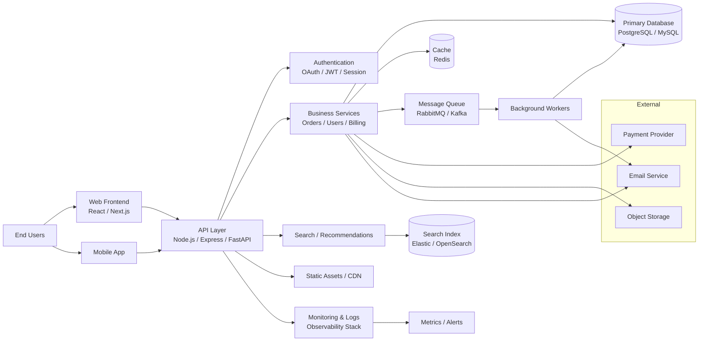

# Architecture Overview

This document provides a high-level view of a modern application architecture, showing how users, client interfaces, backend services, and data stores interact.

## Key Components

- Client Layer: web and mobile clients that interact with the platform.
- API Layer: handles authentication, request routing, validation, and orchestration.
- Business Services: contain domain-specific logic for core application features.
- Data Layer: primary database and caching for fast reads and transactional consistency.
- Async Processing: message queues and worker services for background jobs and notifications.
- External Integrations: payment gateways, email providers, and cloud storage systems.
- Observability: logs, metrics, and monitoring to track system health and performance.

## Notes

This architecture supports scalability, modularity, and clear separation of concerns across the application stack.
